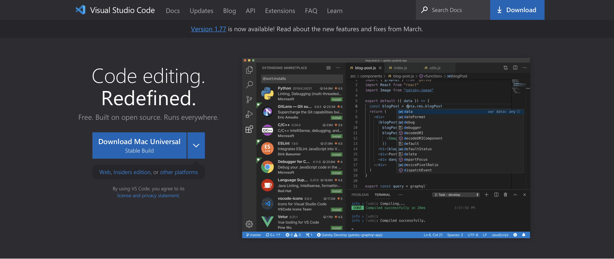
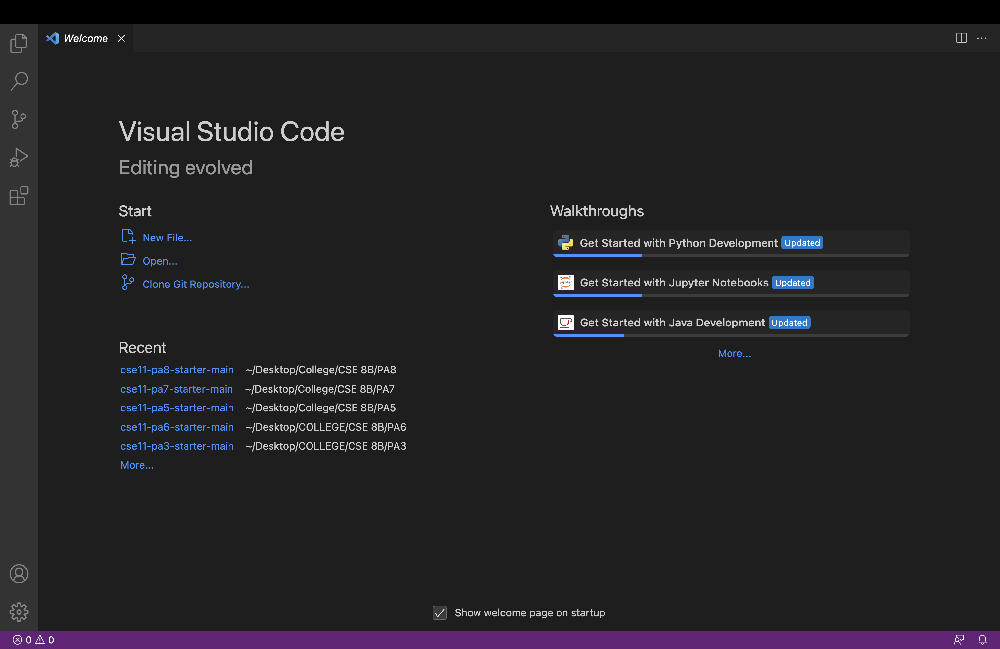
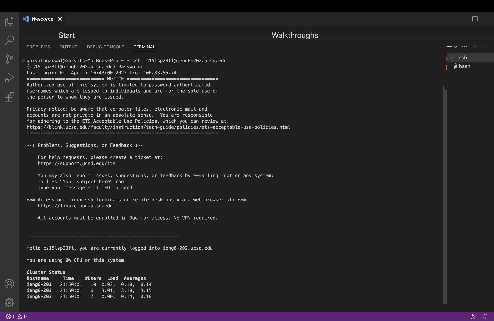

# Lab Report 1
This report covers installation of Visual Studio Code, remotely connecting, and trying out commands. 
## Installling Visual Studio Code
In order to install Visual Studio Code(VScode) I would normally have to go to the VScode website hosted [here](https://code.visualstudio.com/). However, since I had already installed VScode previously I skipped this step and proceeded onto remotely connecting. In order to download it I followed instructions stated on the website and downloaded the appropriate version for my laptop which was the Mac Universal Build.

After following the steps and downloading it VScode should look like this

## Remotely Connecting
In order to begin Remotely Connecting I first had to find out my course specific account and reset my password. After doing that I could begin attempting to try to remotely connect to the ieng6 server. I start by running an ssh command on the terminal 
```
$ ssh cs15lsp23fl@ieng6.ucsd.edu
```
This prompts me to confirm my decision of connecting to the sever since this was my first time connecting to it.
```
The authenticity of host 'ieng6.ucsd.edu (128.54.70.227)' can't be established.
RSA key fingerprint is SHA256:ksruYwhnYH+sySHnHAtLUHngrPEyZTDl/1x99wUQcec.
Are you sure you want to continue connecting (yes/no/[fingerprint])? 
```
I respong yes to this after which I am prompted to input a password after which I gain acess to the server.
This looks like this on the terminal

I faced some difficulties connecting to the server wherein I would get a message on my terminal after inputing my password
```
garvitagarwal@Garvits-MacBook-Pro ~ % ssh cs15lsp23fl@ieng6.ucsd.edu 
(cs15lsp23fl@ieng6.ucsd.edu) Password: 
Connection to ieng6.ucsd.edu closed by remote host.
Connection to ieng6.ucsd.edu closed.
```
To get around this I resorted to connecting to a different server location until a fix is found.
```
ssh cs15lsp23fl@ieng6-202.ucsd.edu
```

## Run Some Commands
Having gained acess to the server I can now run commands on the system. I tried running a couple commands that gave me information on the directory I am in.

The command I ran first was `ls -a`. This command returns all the files and directories in the current directory, including hidden files or directories.
We can see files listed with a "." in front of their names. This "." acts as a marker to define a file or directory as hidden.

To verify that the files with "." really are hidden I ran just ` ls ` as this only returns files and directories that are not hidden in the current directory. This command gave me the output as above showing only "perl5" and "wavelet"  as they are the only non hidden directories.

Now I tried to change my directory by oving into the wavelet folder. In order to do that I used the command `cd ~/wavelet`. Now I was in the wavelet directory and the terminal changed to reflect that

The portion highlighted shows that I am now in the wavelet directory.

Now I maved back to the parent directory by using the command `cd ~` and ran my final command `ls -lat`. This command like `ls -a` listed out all the files and directories in my current directory including hidden ones; however, it also provided more information like date and time along with the user information.
