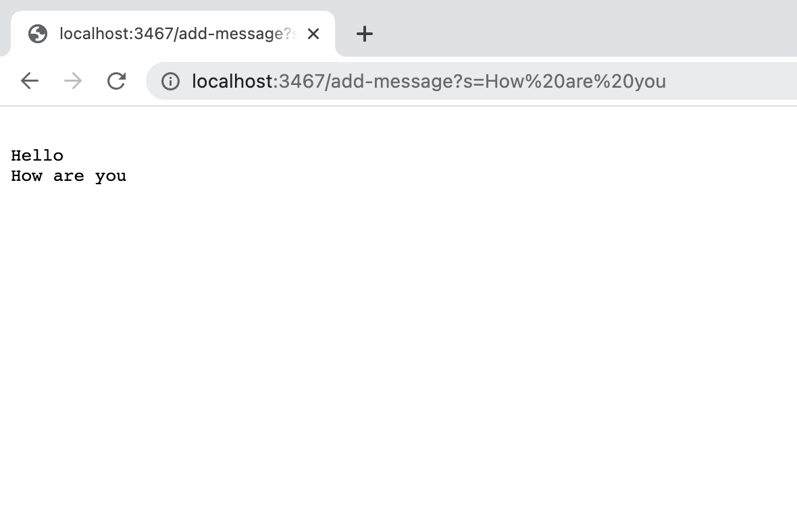
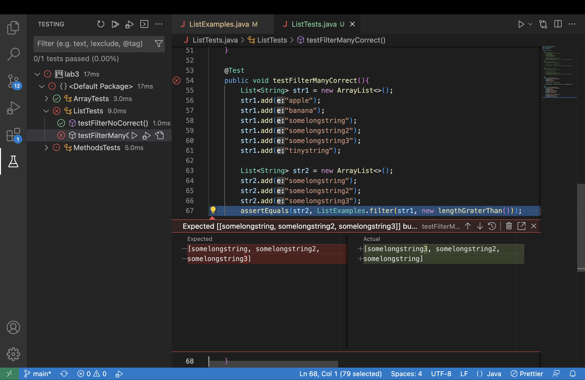

# Lab Report 2
This report covers creation of a simple server, my approach and understanding of one of the bugs discussed in lab 3, and the discription of something new I learnt in labs 2-3.
## Part 1
In order to begin implementing the server I took inspiration from the Server.java and NumberServer.java files provided to us in lab-2. I understood that I only need to make minor changes to these to omplement to server that can perform the tasks as described in the prompt. My code for the implementation is as follows.
```
# StringServer.java
import java.io.IOException;
import java.net.URI;

class Handler implements URLHandler {
    // The one bit of state on the server: a number that will be manipulated by
    // various requests.
    String str = "";

    public String handleRequest(URI url) {
        if (url.getPath().equals("/")) {
            return str;
        }
        else {
            System.out.println("Path: " + url.getPath());
            if (url.getPath().contains("/add-message")) {
                String[] parameters = url.getQuery().split("=");
                if (parameters[0].equals("s")) {
                    str = str + "\n" + parameters[1];
                    return str;
                }
            }
            return "404 Not Found!";
        }
    }
}

class StringServer {
    public static void main(String[] args) throws IOException {
        if(args.length == 0){
            System.out.println("Missing port number! Try any number between 1024 to 49151");
            return;
        }

        int port = Integer.parseInt(args[0]);

        Server.start(port, new Handler());
    }
}
```
```
# Server.java
// A simple web server using Java's built-in HttpServer

// Examples from https://dzone.com/articles/simple-http-server-in-java were useful references

import java.io.IOException;
import java.io.OutputStream;
import java.net.InetSocketAddress;
import java.net.URI;

import com.sun.net.httpserver.HttpExchange;
import com.sun.net.httpserver.HttpHandler;
import com.sun.net.httpserver.HttpServer;

interface URLHandler {
    String handleRequest(URI url);
}

class ServerHttpHandler implements HttpHandler {
    URLHandler handler;
    ServerHttpHandler(URLHandler handler) {
      this.handler = handler;
    }
    public void handle(final HttpExchange exchange) throws IOException {
        // form return body after being handled by program
        try {
            String ret = handler.handleRequest(exchange.getRequestURI());
            // form the return string and write it on the browser
            exchange.sendResponseHeaders(200, ret.getBytes().length);
            OutputStream os = exchange.getResponseBody();
            os.write(ret.getBytes());
            os.close();
        } catch(Exception e) {
            String response = e.toString();
            exchange.sendResponseHeaders(500, response.getBytes().length);
            OutputStream os = exchange.getResponseBody();
            os.write(response.getBytes());
            os.close();
        }
    }
}

public class Server {
    public static void start(int port, URLHandler handler) throws IOException {
        HttpServer server = HttpServer.create(new InetSocketAddress(port), 0);

        //create request entrypoint
        server.createContext("/", new ServerHttpHandler(handler));

        //start the server
        server.start();
        System.out.println("Server Started! Visit http://localhost:" + port + " to visit.");
    }
}
```
Most of the code for StringServer.java is the same as that of NumberServer.java, and the code of Server.java remains unchanged.
This code when run looks like this on a browser

The methods called by the URL `localhost:3467/add-message?s=How are you` calls the handleRequest method in StringServer.java. The only argument it takes is "url" which is of type "URI". When this is called it creates a new String[] which contains the query in the URL after splitting it in two parts where the first part is the command and the second part is the string to be added. This changes the global variable str from "Hello" to "Hello \n How are you". 

The methods called by the URL `localhost:3467/add-message?s=Are you good` calls the same method as the URL `localhost:3467/add-message?s=How are you` as discussed above, that is it calls handleRequest in StringServer.java. Like before the only variable being updated is the global variable str which changes from "Hello \n How are you" to ""Hello \n How are you \n Are you good"
All the URL calls are recorded in the terminal which look like this


## Part 2
The bug I chose is from ListExamples.java. In the code the method filter does not operate correctly all the time. One such instance is 
```
@Test
    public void testFilterManyCorrect(){
        List<String> str1 = new ArrayList<>();
        str1.add("apple");
        str1.add("banana");
        str1.add("somelongstring");
        str1.add("somelongstring2");
        str1.add("somelongstring3");
        str1.add("tinystring");       
        
        List<String> str2 = new ArrayList<>();
        str2.add("somelongstring");
        str2.add("somelongstring2");
        str2.add("somelongstring3");
        assertEquals(str2, ListExamples.filter(str1, new lengthGraterThan()));
    }
```
However, despite the buggy code the method returns the correct output on some inputs, for example 
```
@Test
    public void testFilterNoCorrect(){
        List<String> str1 = new ArrayList<>();
        str1.add("apple");
        str1.add("banana");
        str1.add("tinystring");       
        
        List<String> str2 = new ArrayList<>();

        assertEquals(str2, ListExamples.filter(str1, new lengthGraterThan()));
    }
```

**Symptom**

It appears that the output of the filter is in reverse order than what the output should be. 

**Fix**
```
# Before
static List<String> filter(List<String> list, StringChecker sc) {
    List<String> result = new ArrayList<>();
    for(String s: list) {
      if(sc.checkString(s)) {
        result.add(0,s);
      }
    }
    return result;
  }
```
```
# After
static List<String> filter(List<String> list, StringChecker sc) {
    List<String> result = new ArrayList<>();
    for(String s: list) {
      if(sc.checkString(s)) {
        result.add(s);
      }
    }
    return result;
  }
```
It seems the problem was that the function added new elements at the Index 0, rather than at the end of the list.

## Part 3
In lab 2 I learnt how to use Github desktop and how it can be used to push changes made to a git repository easily. What I learnt is how to create a clone of the repository localy and then use Visual Studio Code to make changes to the code. These changes are detected automatically and can be pushed onto the master file through the Desktop app directly.  
