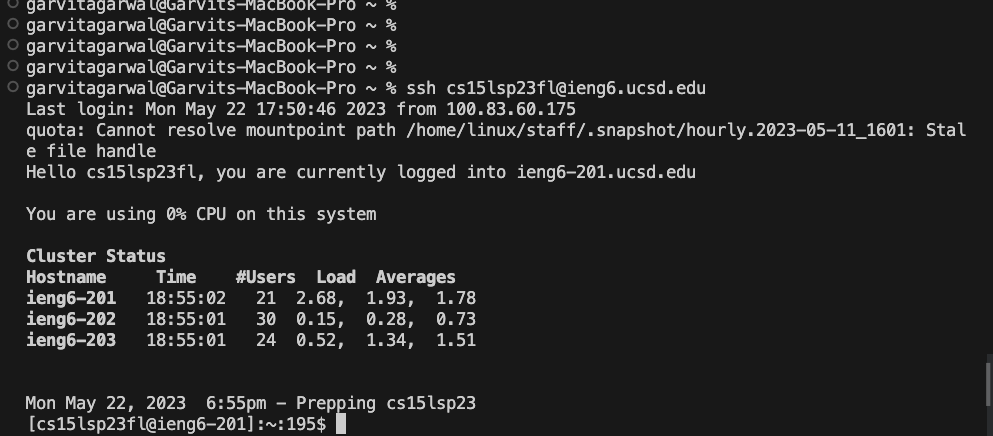
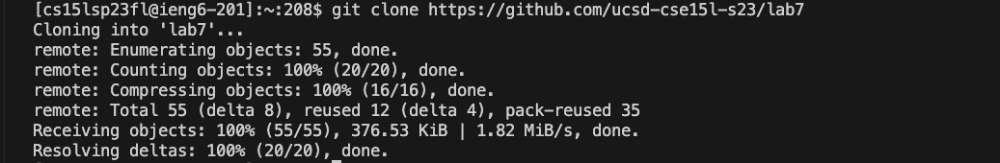
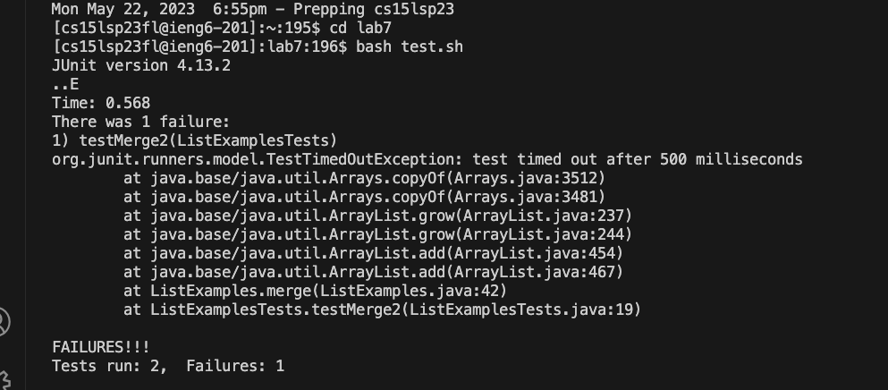
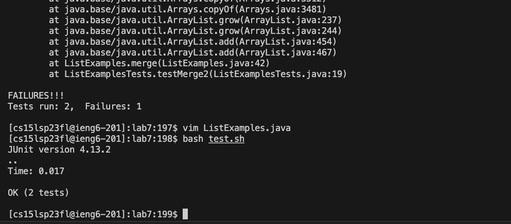
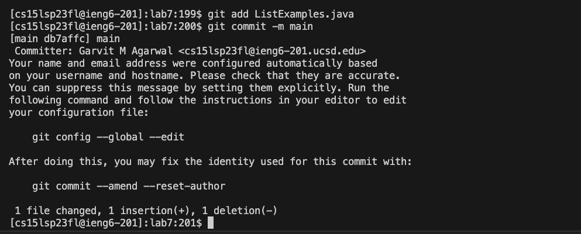
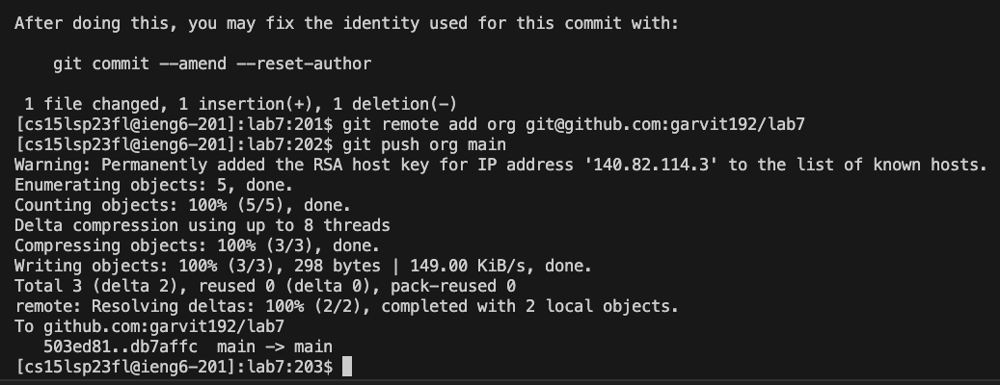

# Lab report 4
This lab covers using vim and git commands to edit and push changes directly from the terminal.

## Step 4

first enter `ssh cs15lsp23fl@ieng6.ucsd.edu` and `<return>` this will directly log into the remote account without a password.

## Step 5

enter the command `git clone https://github.com/ucsd-cse15l-s23/lab7` and `<return>` this will clone the repository onto the ieng6 machine.

## Step 6

In order to run the tests first move into the lab7 directory. Use the `cs lab7` and press `<return>` to move there. Then enter `bash t<tab>` which autocompletes to `bash test.sh` and press `<return>` which will run the Junit tests which fail.

## Step 7

To fix the code I opened it in vim by using the using the keys `vim L<tab>.j<tab>` this auto-compleats to `vim ListExamples.java` then press`<return>`.
Now we are in vim in normal mode. My cursor is in the bottom left of the file so I use `kkkkkklllllllllll` to get to the position to change the index value. I then press `x` to delete 1 in index1. I then press `i` to go into insert mode. I now enter `2<esc>:wq` this will enter 2 where 1 was and escape insert mode into normal mode and then save and exit.

## Step 8

To run the tests again I use `<control>r<up><up><return>` I had the bash command for running the test.sh file in my bash history 2 positions above so I used the arrow key to access it. 

## Step 9

Now to commit and push these changes to github I entered I ran the command `git add L<tab>.j<tab>` and press `<return>` to execute it. I then commit these changes to the main branch by using the command `git commit -m main` and `<return>`. 

Before I push these changes I first create a new save location as the origin that exists uses https instead of ssh in order to push changes. To create a new one I use the command `git remote add org git@github.com:garvit192/lab7`. I can now enter `git push org main` to push my changes onto github. 
