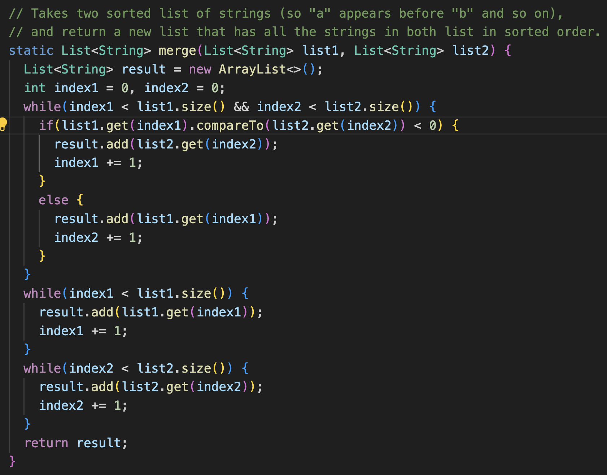
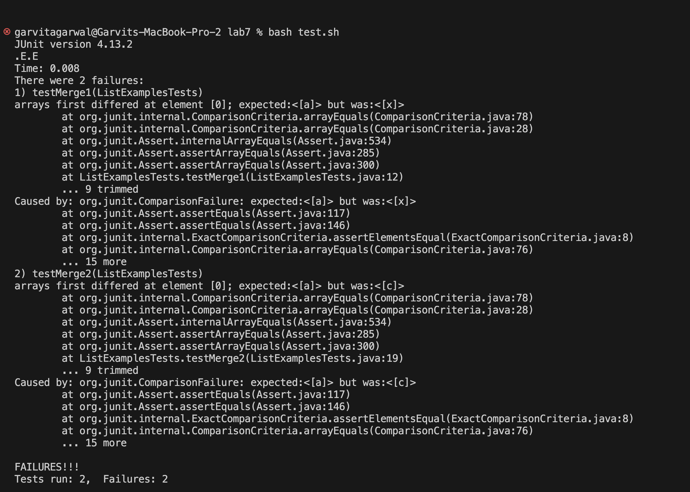
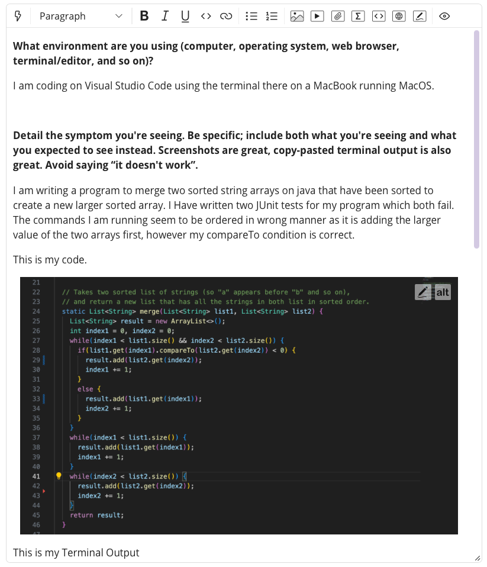
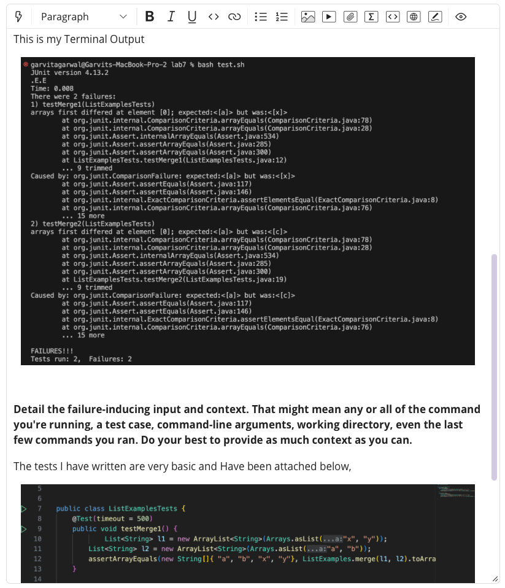
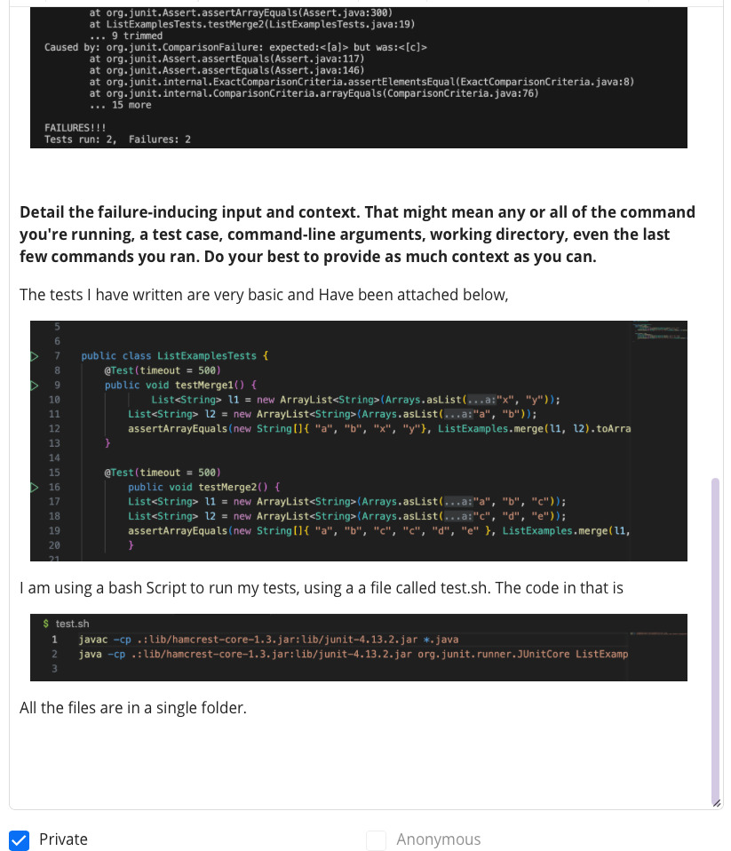
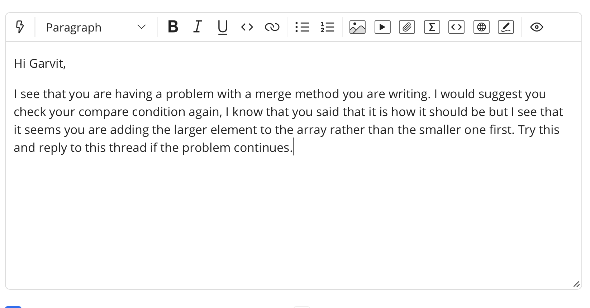
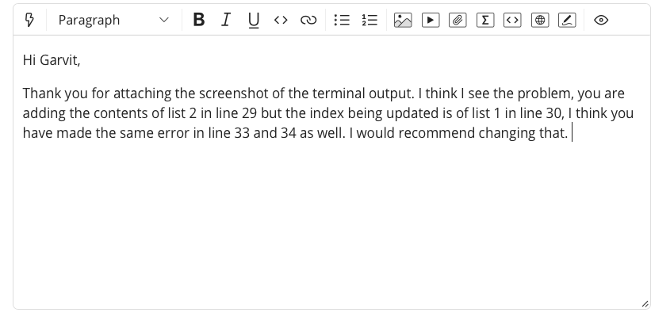
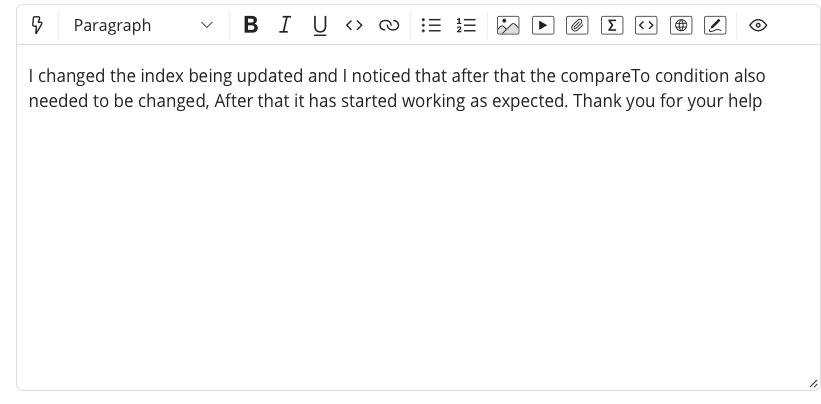
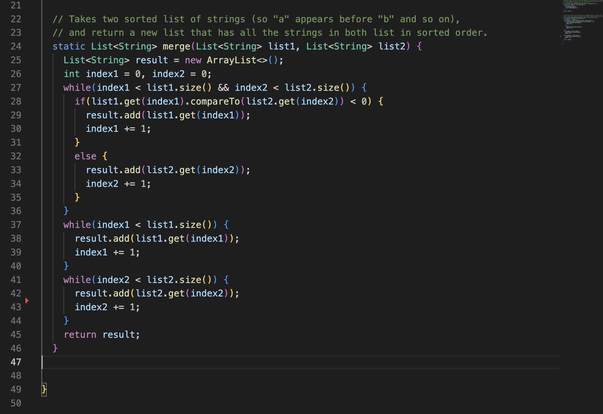

# Lab Report 5
This lab covers a fictional debugging scenario between a student a a tutor, and my reflection of my learning experience in CSE15L.

## Part 1

*Incorrect code*

*Student posts a bug,*

*Response from Tutor*

*Reply from Student*

*Reply from Tutor*

*Reply from Stduent*

*Correct Implementation*

## Part 2
Taking CSE15L this quarter has been really fun. I have learnt a lot of skils that felt really challenging at first but have later turned out to be among the most useful and easy to use for not just this class but even in CSE12 as well. My favourite one which I learnt was how to use Git and Github. Having come to CSE15L without any knowledge of both it felt amazing using this to be able to make changes on my computer and having them be easily uploaded online as a backup or for my friends to see as my colloborators. Even learning vim was something I found really interesting and it shed a new light on how I can work without the need of an environment like VScode.

